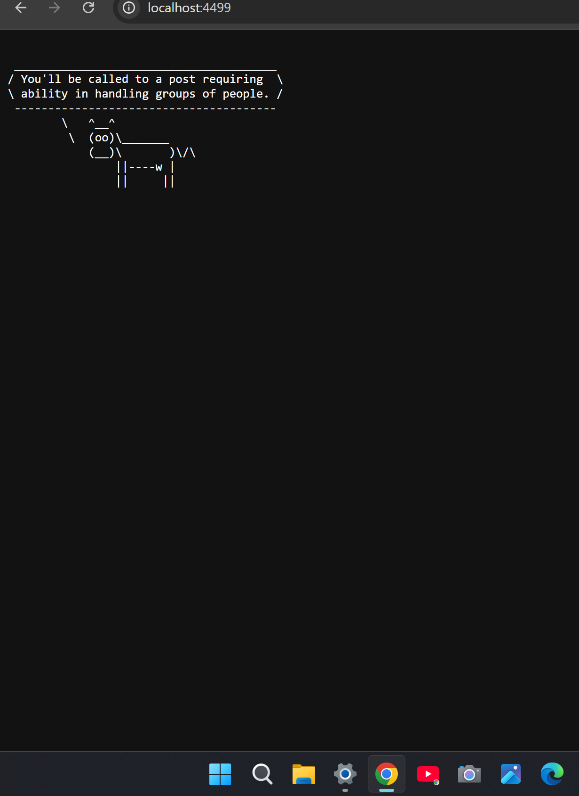

# Wisecow Kubernetes Project

## Overview
**Wisecow** is a containerized application that serves random wisdom quotes using `fortune` and `cowsay`.  
This project demonstrates:

- Building a Docker image
- Deploying it on Kubernetes (Minikube)
- Exposing it via a NodePort service
- Writing simple health check and log analyzer script

## Folder Structure
wisecow-k8s/
├── Dockerfile
├── README.md
├── wisecow.sh
├── k8s/
│   ├── deployment.yaml
│   ├── service.yaml
│   └── ingress.yaml
├── tools/
│   ├── log_analyzer.sh
│   └── app_health_check.sh
└── .github/
    └── workflows/
        └── ci-cd.yml

